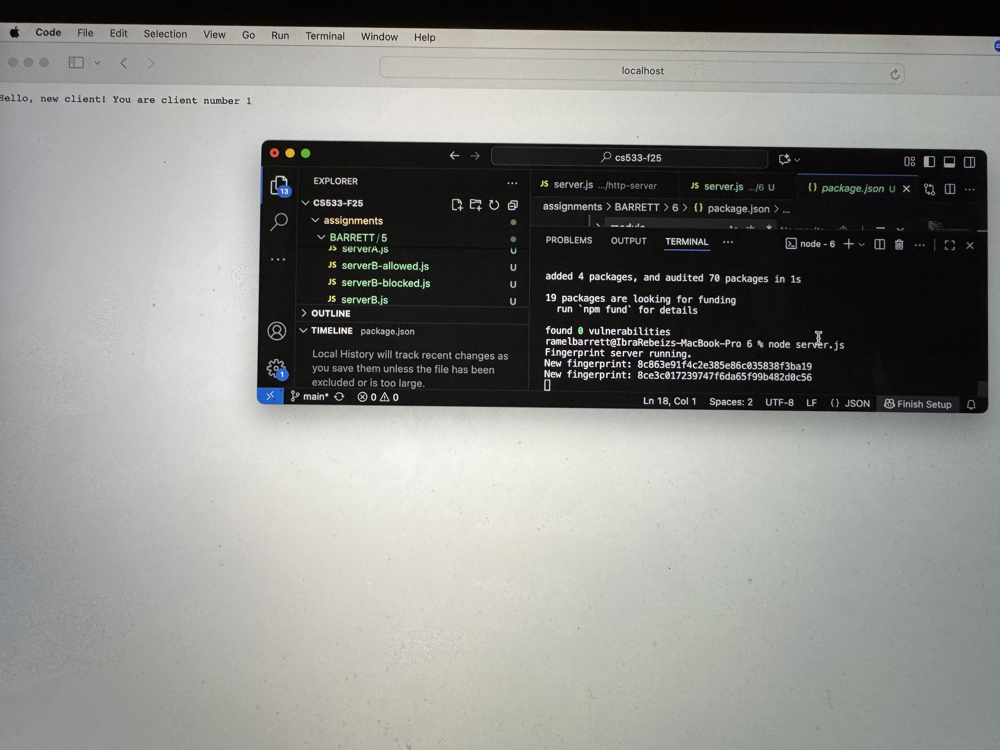
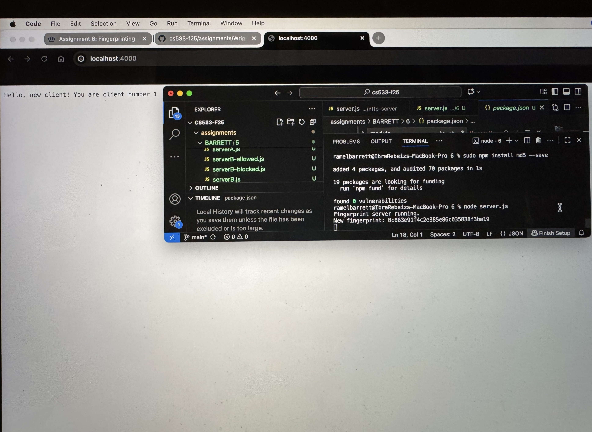
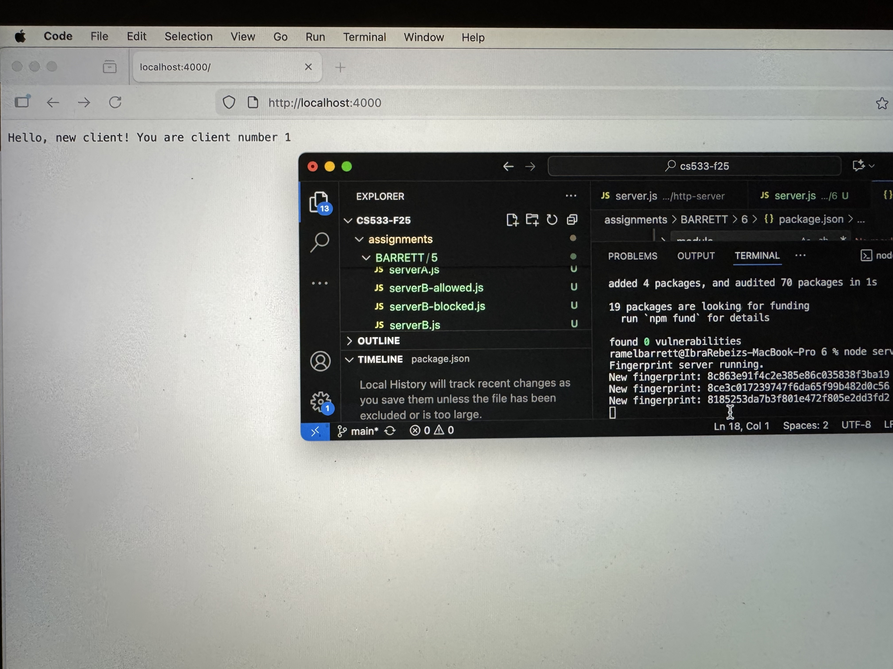
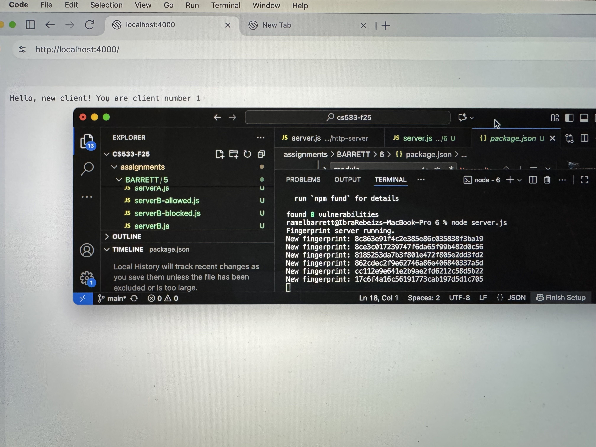

All of the work for this assignment is listed under assignments/BARRETT/6
server.js – Express server that generates and tracks browser fingerprints.
server.log – Server-side log file that records each fingerprint and visit count.
README.md – This file describes the fingerprinting method, how to run the server, and a video link.

Running the server: node server.js 
This will start on localhost:4000 and will log fingerprint activity to server.log

Headers used
The server combines these four headers from each incoming request:

User-Agent
Accept-Language
Accept-Encoding
Accept
These values are read with req.get(...), joined into a single string, and then passed into the md5 function. The result is a hexadecimal hash that serves as the browser’s fingerprint.

Safari Fingerprint

Chrome Fingerprint

Firefox Fingerprint

Opera Fingerprint

Brave Fingerprint

Shift Fingerprint

Youtube Link: https://youtu.be/wioDv1XznzI 