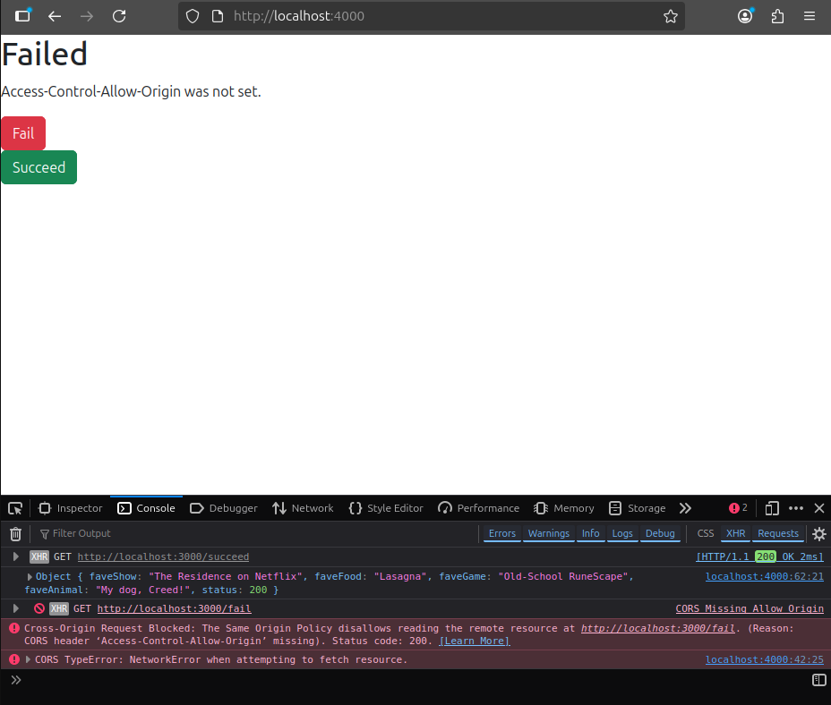
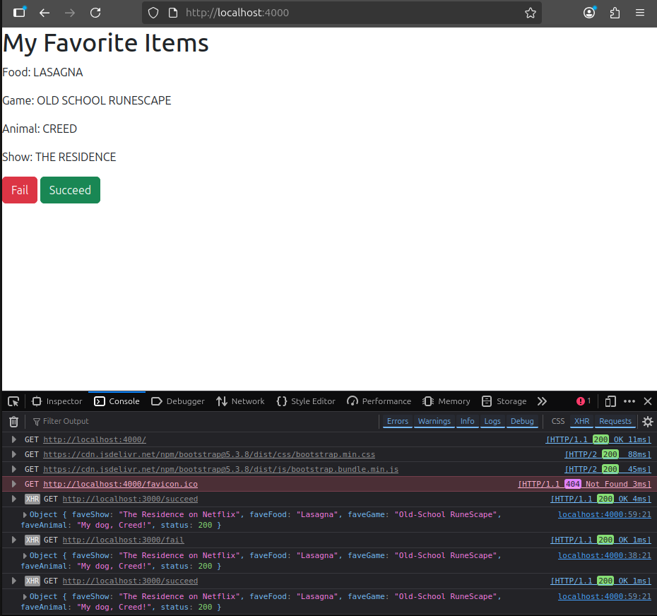
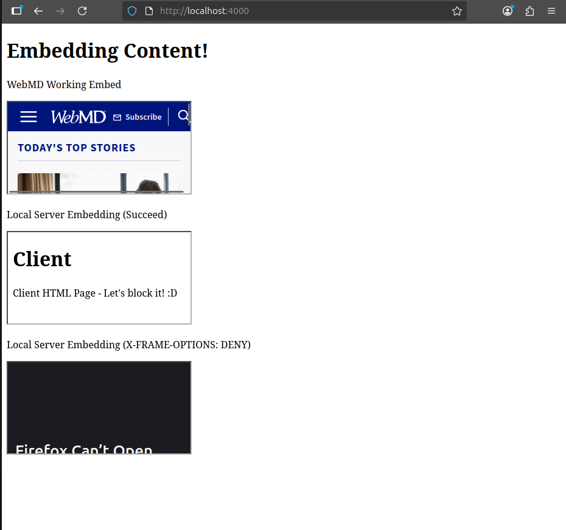

# Assignment 5: Cross Origin Resource Sharing

## 5.1 - Blocking and reading responses from another Origin
This is accomplished through running two servers - a local server and a file server that delivers .json data through an API call made within the index.html page. When accessing the /fail endpoint, Access-Control-Allow-Origin is NOT set and results in a CORS error. When accessing the /succeed endpoint, the proper header is set and json is returned in the console. You can see the error and success below.

Video: https://youtu.be/x08VVgxwQaY

## 5.2 - Blocking and reading HTTP response headers from another origin
Like 5.1, I used a dual server setup but instead of reading JSON data, I ran a script that pulled the custom X-CS533f25-* headers and replaced data on the page with the data pulled from the headers. Both endpoints (/fail and /succeed again) have the same headers set so the same data is embedded within both. However, only /succeed has Access-Control-Expose-Headers enabled, which exposes the headers to scripting and allows data to populate at the top of the page. Otherwise, the headers return null and the data is removed.

Video: https://youtu.be/Ke6SmR6QN_w

## 5.3
Two servers are used again, except now I'm embedding the fileServer's client.html into the primary server's index.html. I have https://www.webmd.com embedded at the top to show that embedding works. The two file server iframes are pointed to /show-iframe and /hide-iframe endpoints, with the difference being /hide-iframe having X-Frame-Options set to DENY.

Video: https://youtu.be/fR7SZVfBm8A