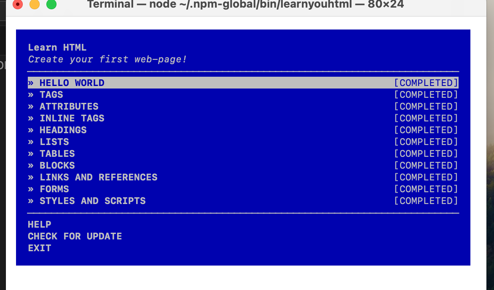
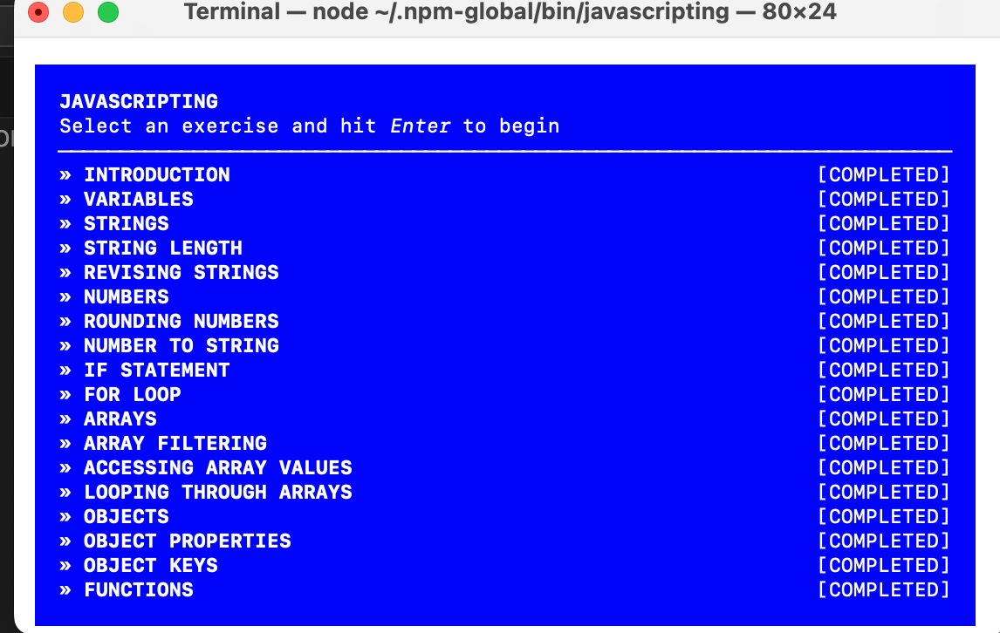
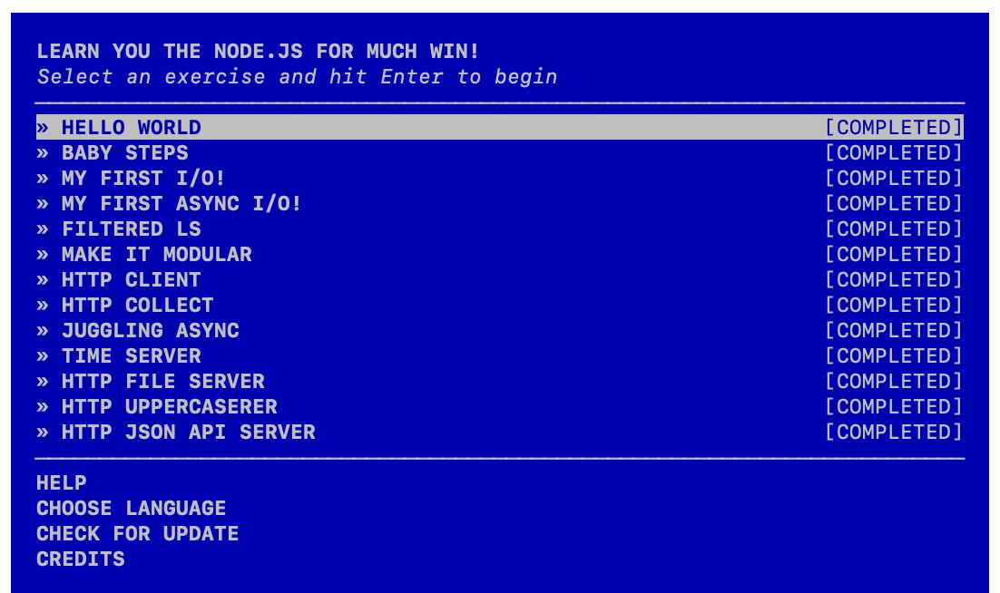

# Assignment 1 — MASON

We have three directories:
- [html](./html)
- [javascript](./javascript)
- [node](./node)

## Description
This assignment used three NodeSchool workshops:
- **LearnYouHTML** – HTML tags, structure, attributes
- **Javascripting** – JS basics (variables, arrays, loops, functions)
- **LearnYouNode** – Node.js programs, modules, callbacks, HTTP
## Directory Structure 
``` 
assignments/ 
  MASON/ 
    1/ 
      html/ # HTML exercise solutions 
      javascript/ # JavaScript solutions 
      node/ # Node.js solutions 
      screenshots/ # images for proof of completion 
```
## Screenshots
> Place these images in `assignments/MASON/1/screenshots/`.




## Video Demo
[Click here to watch on YouTube](https://youtu.be/sozopWW_048)

The video shows me listing all files in each folder and the completion screens for all workshops.
