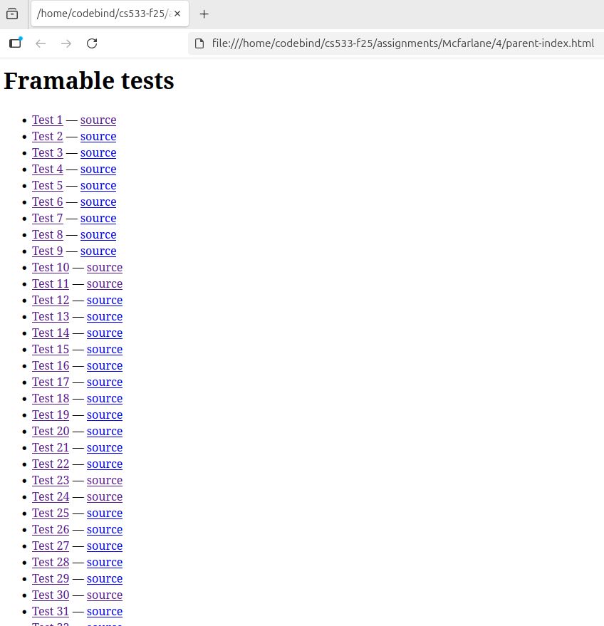
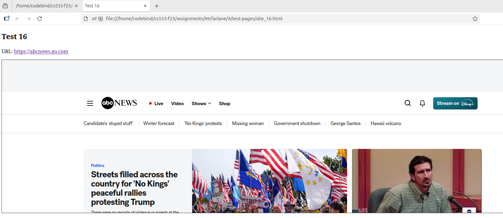
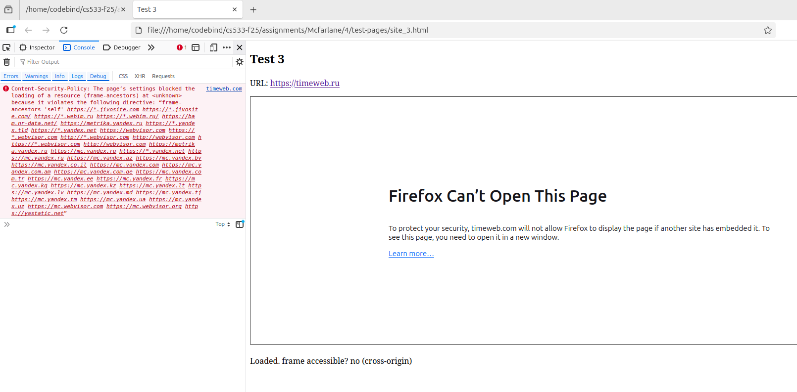
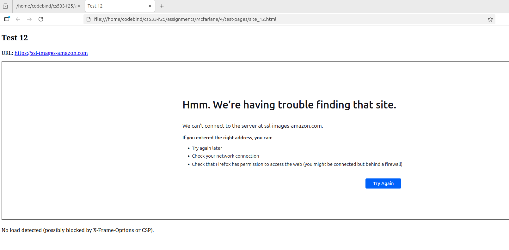

# Website Frame Embedding Analysis

## Part A Overview

This project investigates whether popular websites can be **embedded inside an `<iframe>`**.  
We analyzed two main security headers:

- **X-Frame-Options** — Controls whether the site can be framed.
- **Content-Security-Policy (CSP)** — Specifically, the `frame-ancestors` directive, which defines allowed framing origins.

Together, these headers determine if a website is **framable** or **protected** against clickjacking and embedding.

---

## Files Used

### `header-check.js`
This Node.js script checks each site's HTTP response headers using `fetch()` requests and extracts:

- `X-Frame-Options`
- `Content-Security-Policy` → `frame-ancestors` value
- Response status or error messages

It outputs the results in a CSV file with columns:

| site | url | status | x-frame-options | frame-ancestors | notes |

#### Run Command:
```bash
node header-check.js AMCFA010@ODU.EDU results.csv
```

The script:

- Automatically adds https:// to URLs.
- alls back from HEAD to GET if the server doesn’t support HEAD.
- Handles fetch errors gracefully.

---

### `generator.js`

This script creates test HTML pages that embed each site inside an `<iframe>` to visually check if the page loads or is blocked by browser policies.

It automatically:

- Adds https:// to all URLs.
- Generates one test file per site (e.g., test-pages/site_1.html).
- Creates a master index file parent-index.html linking to all test pages.

#### Run Command:
```bash
node generator.js
```

---

## Method Summary

1. Collect top websites (from a list file).

2. Run header-check.js to extract framing-related headers.

3. Generate test HTML pages via generator.js.

4. Open parent-index.html in a browser to manually verify which sites frame successfully.

5. Combine technical and visual findings into the following table.

---
## 🧩 Framing Results Summary

| Site | Framable? | How It Defeats / Reason |
|------|------------|--------------------------|
| finance.yahoo.com | Not Framable | X-Frame-Options: SAMEORIGIN; CSP limits to AOL and Yahoo subdomains. |
| plos.org | Not Framable | HTTP 403 Forbidden; explicitly rejects external embedding. |
| timeweb.ru | Not Framable | SAMEORIGIN; CSP restricts framing to Yandex and analytics domains. |
| foxnews.com | ✅ Framable | No X-Frame-Options or CSP blocking found. |
| java.com | ✅ Framable | No framing headers detected. |
| focus.de | ✅ Framable | No restrictions on framing. |
| bbc.com | Not Framable | X-Frame-Options: SAMEORIGIN. |
| sapo.pt | Not Framable | X-Frame-Options: SAMEORIGIN blocks embedding. |
| usatoday.com | Not Framable | X-Frame-Options: DENY; CSP frame-ancestors 'none'. |
| nypost.com | Not Framable | SAMEORIGIN; CSP limits to own and partner domains (thesun.co.uk, pagesix.com). |
| mashable.com | ✅ Framable (Partial) | CSP allows selected sources (`*.mashable.com`, `*.ampproject.org`). |
| ssl-images-amazon.com | ⚠️ Unreachable | Network fetch failed. |
| youtube.com | Not Framable | SAMEORIGIN; only special embed URLs allowed. |
| themeforest.net | Not Framable | X-Frame-Options: SAMEORIGIN. |
| opera.com | Not Framable | SAMEORIGIN; restricted to own subdomains. |
| abcnews.go.com | ✅ Framable | No blocking headers found. |
| pinterest.com | Not Framable | SAMEORIGIN; extensive CSP restrictions. |
| ggpht.com | ⚠️ Unreachable | Fetch failed. |
| apache.org | Not Framable | CSP: frame-ancestors 'none'. |
| variety.com | Not Framable | CSP: frame-ancestors 'none'. |
| id.wikipedia.org | ✅ Framable | No XFO or CSP restrictions. |
| marca.com | ✅ Framable | No framing headers found. |
| sputniknews.com | ✅ Framable | No blocking headers detected. |
| hp.com | Not Framable | SAMEORIGIN (repeated); 503 error. |
| mailchimp.com | Not Framable | X-Frame-Options: SAMEORIGIN. |
| disqus.com | ✅ Framable | No blocking headers found. |
| files.wordpress.com | Not Framable | SAMEORIGIN restriction. |
| tripadvisor.com | ✅ Framable | No frame restrictions detected. |
| cornell.edu | ✅ Framable | No CSP or XFO restrictions. |
| planalto.gov.br | ✅ Framable | CSP allows only 'self'. |
| nytimes.com | Not Framable | X-Frame-Options: DENY. |
| search.yahoo.com | Not Framable | DENY and CSP frame-ancestors 'none'. |
| gsmarena.com | ✅ Framable | CSP allows *.gsmarena.com (same network). |
| europapress.es | ✅ Framable | No blocking headers found. |
| yandex.ru | Not Framable | CSP restricts framing to its own services and domains. |
| buydomains.com | ⚠️ Unreachable | Network fetch failed. |
| tiktok.com | ⚠️ Unreachable | Fetch failed (timeout). |
| bloomberg.com | ✅ Framable (Partial) | CSP allows *.bloomberg.com only. |
| abc.es | ✅ Framable | No restrictions found. |
| gofundme.com | ✅ Framable | No framing headers present. |
| kakao.com | ✅ Framable | No restrictions. |
| depositfiles.com | Not Framable | SAMEORIGIN; limited to internal domains. |
| nba.com | Not Framable | X-Frame-Options: sameorigin. |
| wired.com | ✅ Framable | No CSP/XFO restrictions. |
| cdc.gov | ✅ Framable | No restrictions detected. |
| amazon.de | Not Framable | SAMEORIGIN. |
| sony.com | Not Framable | SAMEORIGIN; 403 Forbidden. |
| goo.gl | Not Framable | SAMEORIGIN; link shortener. |
| 20minutos.es | Not Framable | sameorigin restriction. |
| reuters.com | ✅ Framable (Partial) | CSP allows only self-origin. |
| m.me | Not Framable | DENY; strict frame blocking. |
| news.yahoo.com | Not Framable | SAMEORIGIN; restricted to Yahoo and AOL networks. |
| w3.org | ✅ Framable (Partial) | CSP allows only specific subdomains. |
| fifa.com | Not Framable | SAMEORIGIN; CSP restricts to internal apps. |
| theatlantic.com | ✅ Framable | No restrictions found. |
| scholastic.com | Not Framable | sameorigin; restricts embedding. |
| amazon.com | ✅ Framable (Partial) | No XFO found, but dynamic JS may prevent rendering. |
| whatsapp.com | Not Framable | DENY. |
| stackoverflow.com | Not Framable | SAMEORIGIN; CSP restricts to StackExchange network. |
| theverge.com | ✅ Framable (Partial) | CSP allows `platform.theverge.com`. |
| smh.com.au | Not Framable | sameorigin; CSP limits to local domains. |
| deezer.com | Not Framable | SAMEORIGIN. |
| video.google.com | Not Framable | SAMEORIGIN. |
| google.co.jp | Not Framable | SAMEORIGIN. |
| statista.com | Not Framable | DENY and CSP 'none'. |
| springer.com | ✅ Framable | No XFO or CSP restrictions. |
| drive.google.com | Not Framable | 403 Forbidden. |
| www.yahoo.com | Not Framable | SAMEORIGIN; Yahoo and AOL subdomains only. |
| pinterest.fr | Not Framable | SAMEORIGIN; extensive CSP blocking. |
| accounts.google.com | Not Framable | 403 Forbidden (login page). |
| alibaba.com | Not Framable | DENY; framing disabled. |
| photos1.blogger.com | Not Framable | 404 Not Found. |
| google.de | Not Framable | SAMEORIGIN. |
| yelp.com | ✅ Framable | No XFO or CSP found. |
| washingtonpost.com | Not Framable | SAMEORIGIN restriction. |
| apnews.com | ✅ Framable (Partial) | CSP allows cms.apnews.com. |
| sfgate.com | ✅ Framable | No restrictions found. |
| search.google.com | Not Framable | SAMEORIGIN. |
| yadi.sk | ✅ Framable (Partial) | CSP allows only self-origin. |
| cnet.com | ✅ Framable | No restrictions found. |
| plus.google.com | ✅ Framable | No restrictions found. |
| mediafire.com | Not Framable | SAMEORIGIN; CSP limits to subdomains. |
| scribd.com | Not Framable | SAMEORIGIN; CSP self-only. |
| google.ca | Not Framable | SAMEORIGIN. |
| www.gov.uk | ✅ Framable | ALLOWALL — explicitly permits framing. |
| www.canalblog.com | Not Framable | DENY. |
| softonic.com | Not Framable | SAMEORIGIN. |
| www.gov.br | Not Framable | DENY; CSP 'self'. |
| alicdn.com | ⚠️ Unreachable | Fetch failed. |
| 4shared.com | ✅ Framable | No restrictions found. |
| aol.com | Not Framable | SAMEORIGIN. |
| justjared.com | ✅ Framable | No XFO or CSP blocking. |
| uol.com.br | ⚠️ Unreachable | Fetch failed. |
| lefigaro.fr | Not Framable | sameorigin restriction. |
| maps.google.com | Not Framable | SAMEORIGIN. |
| weather.com | Not Framable | SAMEORIGIN. |
| dan.com | ✅ Framable | No restrictions found. |
| radiofrance.fr | Not Framable | SAMEORIGIN; CSP 'self'. |
| sky.com | Not Framable | SAMEORIGIN; CSP self-only. |
| independent.co.uk | Not Framable | SAMEORIGIN; restricts framing. |

## Summary Statistics

| Category | Count | Description |
|-----------|--------|-------------|
| ✅ Framable | 36 | Sites that can be embedded in an iframe (no XFO/CSP restrictions). |
| Not Framable | 57 | Sites that actively block embedding using `X-Frame-Options` or `Content-Security-Policy`. |
| ⚠️ Unreachable | 7 | Sites that failed to load or returned network/time-out errors. |

**Total Sites Analyzed:** 100

### Screenshots
---

_Parent index page testing all 100 HTML pages_:


_Test page showing successful iframe embedding (example):_ 


_Test page showing failure iframe embedding (example):_ 


_Test page showing unreachable iframe embedding (example):_ 

