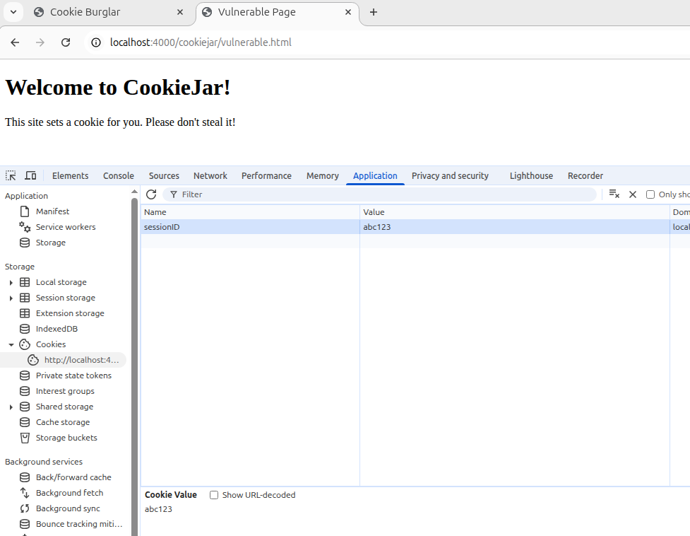
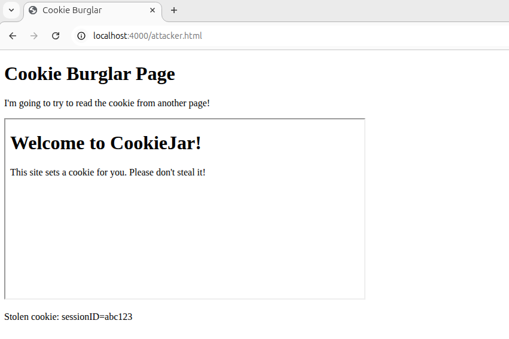
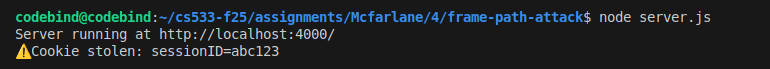

# Part B — Frame Path Attack (brief)

**Idea**  
Show that `Path` alone does **not** prevent same-origin JavaScript from reading cookies. A parent page can iframe a vulnerable page (same origin), read `document.cookie`, and exfiltrate it.

**Files (location: `Mcfarlane/4/frame-path-attack`)**
- `server.js` — serves `public/` and logs `/steal` requests  
- `public/vulnerable.html` — sets `document.cookie = "sessionID=abc123; path=/cookiejar/";`  
- `public/attacker.html` — iframes the vulnerable page, reads `frame.contentDocument.cookie`, and calls `/steal?cookie=...`

**Method (steps)**  
1. Attacker page embeds `http://localhost:4000/cookiejar/vulnerable.html` in an `<iframe>`.  
2. Because both pages share origin, parent reads `iframe.contentDocument.cookie`.  
3. Parent exfiltrates cookie to `/steal` endpoint (logged by server).  
4. `Path` only controls when cookie is *sent* with HTTP requests — it does **not** block same-origin JS access.

**Run (quick)**  
```bash
node server.js
# open http://localhost:4000/attacker.html
```

Watch attacker page show the cookie and server log /steal with sessionID=abc123.

### Screenshots

Vulnerable page sets cookie:



Attacker steals the cookie:



Console output:



### Mitigations (short)

- Use HttpOnly for sensitive cookies.
- Serve sensitive apps on separate origins/subdomains.
- Use SameSite, Secure, CSP/frame-ancestors to reduce embedding and exfiltration.