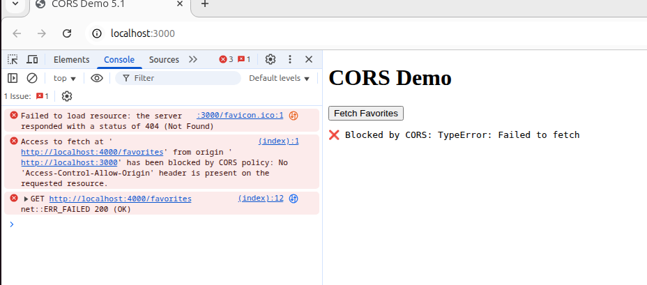
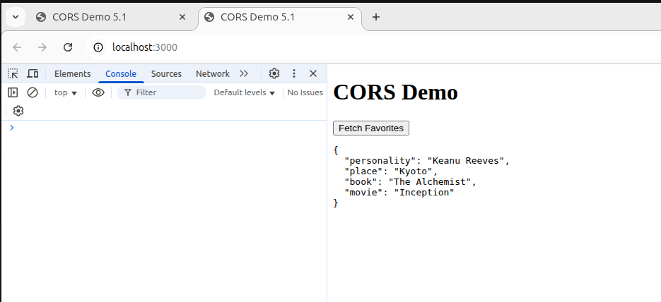
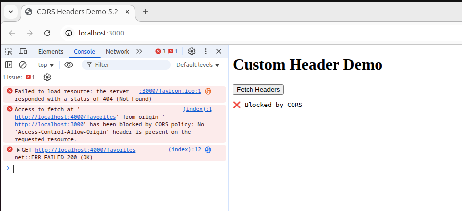
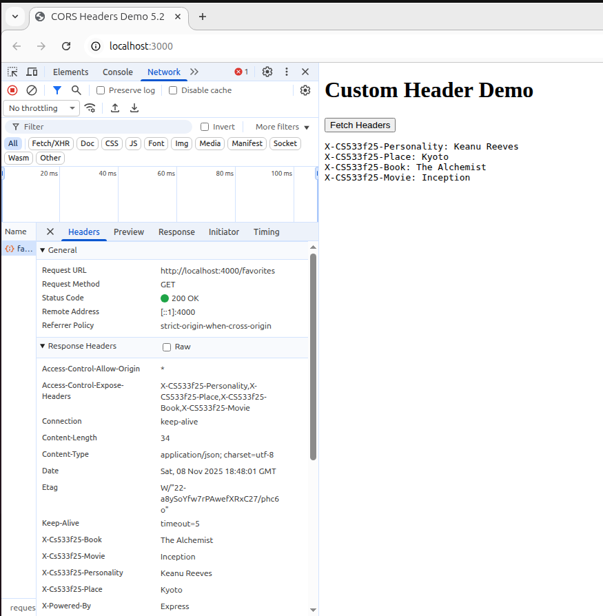
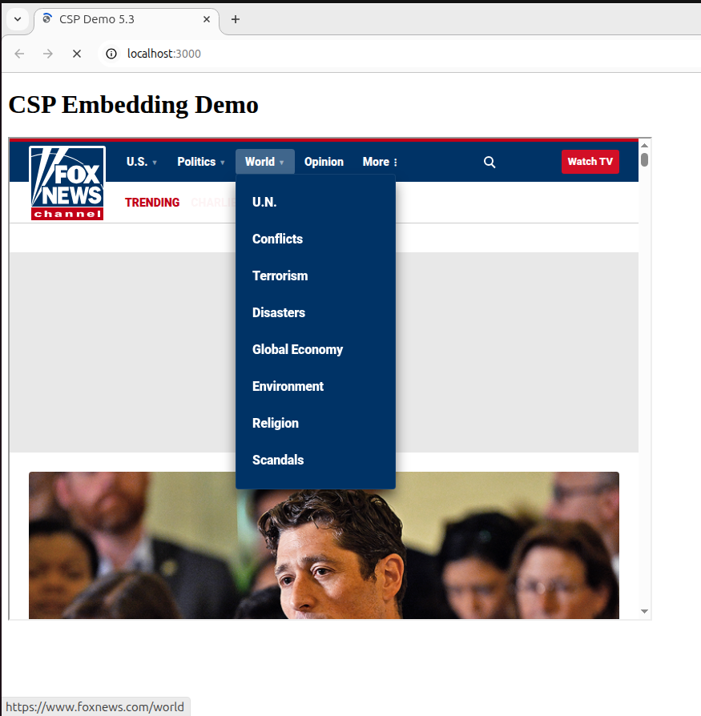

# Assignment 5 - CS 433/533 Web Security (Fall 2025)

**Student Name:** Anthony McFarlane.    
**Due Date:** November 9, 2025  
**Total Points:** 15 (+ 5 Extra Credit)

## Directory Structure

All of the code, files, and related assets for this assignment are contained in directory **`5/`**.

```
5/
├── 5.1/
│ ├── public/
│ │ └── index.html
│ ├── serverA.js
│ └── serverB.js
│
├── 5.2/
│ ├── public/
│ │ └── index.html
│ ├── serverA.js
│ └── serverB.js
│
└── 5.3/
├── index.html
└── server.js
```


Each subdirectory demonstrates a different web-security concept:  
**CORS** (requests and headers) and **CSP** (embedding control).

## Setup Instructions

1. Navigate to each folder (5.1, 5.2, 5.3) before running.
2. Install dependencies (run once per assignment folder):
   ```bash
   npm install express cors cookie-parser
   ```
3. Start both servers as instructed below.

# 5.1 - CORS: Blocking and Reading JSON Responses
## Purpose:
Demonstrate how JavaScript from one origin cannot read a JSON response from another origin until CORS is enabled.

## Files:

[serverA.js](5.1/serverA.js) – Serves public/index.html on http://localhost:3000

[serverB.js](5.1/serverB.js) – Serves a JSON API on http://localhost:4000

[index.html](5.1/public/index.html) – Fetches the JSON data and prints it to screen

## Steps to Run:
```bash
# In one terminal
node serverB.js   # backend (port 4000)

# In another terminal
node serverA.js   # frontend (port 3000)

```

## Screenshots:

_Request getting blocked due  to CORS policy violation_:



_Successful JSON fetch after CORS is enabled_:



## Demonstration Video

👉 [Watch the video on YouTube](https://youtu.be/taaIYmMEHE4)

# 5.2 - CORS: Blocking and Reading HTTP Response Headers
## Purpose:
Demonstrate how custom HTTP headers are blocked by default and how CORS’s exposedHeaders option allows them.

## Files:

[serverA.js](5.2/serverA.js) – Frontend server (same as 5.1)

[serverB.js](5.2/serverB.js) – Sets custom headers (X-CS533f25-Personality, X-CS533f25-Place, X-CS533f25-Book, X-CS533f25-Movie)

[index.html](5.2/public/index.html) – Fetches and displays custom headers

## Steps to Run:
```bash
# In one terminal
node serverB.js   # backend (port 4000)

# In another terminal
node serverA.js   # frontend (port 3000)

```

## Screenshots:

_Request getting blocked due  to CORS policy violation_:



_Successful header data fetch after exposedHeaders is enabled_:



## Demonstration Video

👉 [Watch the video on YouTube](https://youtu.be/wj818PZzm28)

# 5.3 - Content Security Policy (CSP): Embedding from Another Site
## Purpose:
Demonstrate how a site can control embedding of external pages using the Content-Security-Policy header.

## Files:

[server.js](5.3/server.js) – Serves index.html on http://localhost:3000

[index.html](5.3/index.html) – Embeds a remote site (e.g. Fox News) in an `iFrame` element

## Steps to Run:
```bash
node server.js  
```

## Screenshots:

_iframe **successfully displaying** the embedded site (no CSP)_:



_**blocked iframe** after enabling the CSP header_:


## Demonstration Video

👉 [Watch the video on YouTube](https://youtu.be/N5Z2mppf6PM)