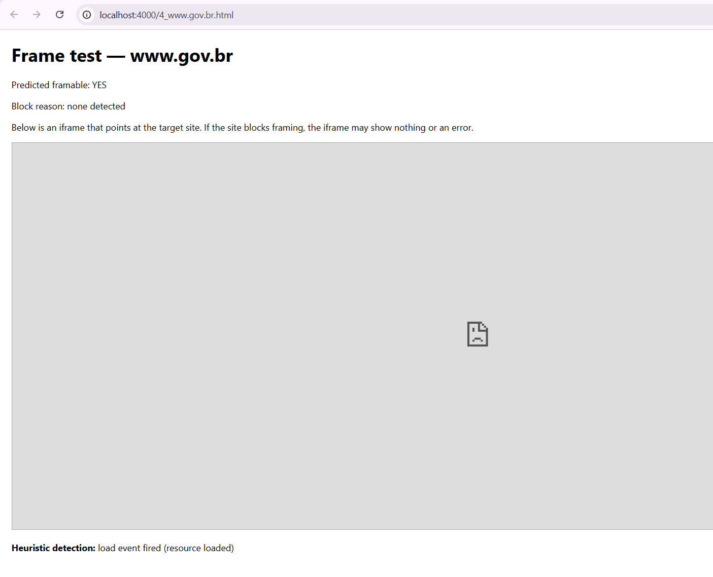
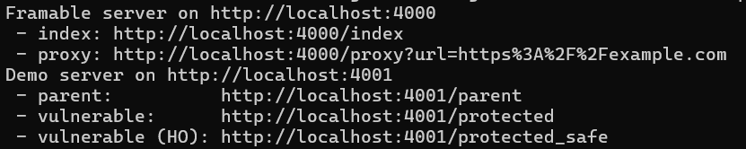
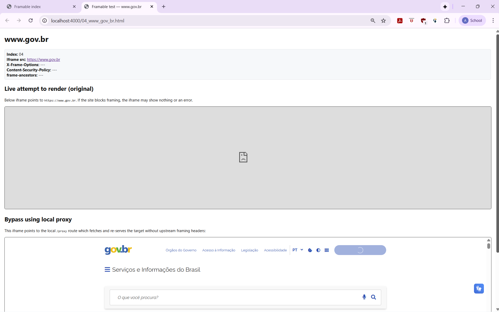

# Assignment 4 Submission

### Directories
All work for this assignment is organized under `assignments/Wright/4` and separated into these folders and files:
- **framable** - html files that attempt to iframe the assigned public sites (index + 100 test pages)
- **frame-path-attack** - this code demonstrates of showing how `Path` is not sufficient to protect cookies
- **results** - partial summary demonstrating framing results from sampled sites
- **full_100results** - complete dataset of all 100 tested sites and their framing results
- **extra_credit** - showcasing bypassing the 10 websites
- **screenshots** - consist of screenshots
- **README.md** - contains assignment description, methods, results, extra credit, and video links

---

### Framable Sites
These websites from my list of 100 that successfully rendered inside an ```<iframe>``` and were not blocked by any browser security headers and CSP policies.

| No. | Site                                  |
| --: | ------------------------------------- |
|   1 | ytimg.com                             |
|   4 | [www.gov.br](http://www.gov.br)       |
|  13 | rt.com                                |
|  14 | sedoparking.com                       |
|  20 | dan.com                               |
|  21 | reg.ru                                |
|  23 | clarin.com                            |
|  25 | amazon.com                            |
|  38 | qq.com                                |
|  41 | ggpht.com                             |
|  46 | gfycat.com                            |
|  47 | list-manage.com                       |
|  51 | globo.com                             |
|  55 | npr.org                               |
|  56 | bp.blogspot.com                       |
|  60 | narod.ru                              |
|  62 | jimdofree.com                         |
|  64 | ikea.com                              |
|  65 | sony.com                              |
|  67 | es.wikipedia.org                      |
|  70 | picasa.google.com                     |
|  71 | archive.org                           |
|  75 | boston.com                            |
|  79 | fr.wikipedia.org                      |
|  83 | liveinternet.ru                       |
|  87 | [www.yahoo.com](http://www.yahoo.com) |
|  91 | ja.wikipedia.org                      |
|  92 | secureserver.net                      |
|  95 | id.wikipedia.org                      |
|  32 | repubblica.it                         |

---

### Websites Blocking Framing Using X-Frame-Options
The sites below prevented from being framed by sending an ```X-Frame-Options``` header to either being ```DENY``` or ```SAMEORIGIN```, which stops the browsers from not embedding them in the iframes from external origins.

| No. | Site                   | X-Frame-Options |
| --: | ---------------------- | --------------- |
|   2 | plus.google.com        | sameorigin      |
|   3 | mailchimp.com          | sameorigin      |
|   5 | google.com.tw          | sameorigin      |
|   8 | nasa.gov               | sameorigin      |
|  11 | gmail.com              | sameorigin      |
|  12 | google.fr              | sameorigin      |
|  15 | arxiv.org              | sameorigin      |
|  17 | usgs.gov               | sameorigin      |
|  19 | cointernet.com.co      | sameorigin      |
|  22 | fb.me                  | deny            |
|  26 | adssettings.google.com | sameorigin      |
|  29 | gettyimages.com        | sameorigin      |
|  30 | ibm.com                | sameorigin      |
|  40 | canada.ca              | deny            |
|  44 | vimeo.com              | sameorigin      |
|  49 | amazon.de              | sameorigin      |
|  50 | office.com             | sameorigin      |
|  52 | goo.ne.jp              | sameorigin      |
|  53 | support.google.com     | sameorigin      |
|  59 | bbc.com                | sameorigin      |

---

## Websites Blocking Framing Using Content-Security-Policy
These sites utilize the ```Content-Security-Policy``` header with the ```frame-ancestors``` directive for restriction/complete blocking from being embedded, thus offering more in-depth control than ```X-Frame-Options```.

| No. | Site         | CSP Directive                                           |
| --: | ------------ | ------------------------------------------------------- |
|  18 | bbc.co.uk    | frame-ancestors 'none'                                  |
|  35 | gofundme.com | frame-ancestors gofundme.com                            |
|  37 | nikkei.com   | frame-ancestors 'self'                                  |
|  42 | theverge.com | frame-ancestors 'self'                                  |
|  48 | ft.com       | frame-ancestors 'self'                                  |
|  54 | tiktok.com   | frame-ancestors [www.tiktok.com](http://www.tiktok.com) |
|  58 | loc.gov      | frame-ancestors *.loc.gov                               |
|  61 | spotify.com  | frame-ancestors 'self'                                  |
|  73 | timeweb.ru   | frame-ancestors *.timeweb.ru                            |
|  86 | walmart.com  | frame-ancestors *.walmart.com                           |
|  90 | mozilla.org  | frame-ancestors 'none'                                  |
|  94 | scribd.com   | frame-ancestors 'self'                                  |
|  97 | mirror.co.uk | frame-ancestors 'self'                                  |
| 100 | ebay.com     | frame-ancestors *.ebay.com                              |

---

## Remaining Websites
The following sites had inconsistent framing protections (or mixed results) due to one of the following reasons: sending conflicting ```X-Frame-Options``` and ```Content-Security-Policy``` headers and/or rendering conflicting headers across various subdomains.

| No. | Site                  | Mixed or Unclear Policy |
| --: | --------------------- | ----------------------- |
|   7 | uol.com.br            | both CSP + XFO          |
|  43 | stores.jp             | both CSP + XFO          |
|  63 | sites.google.com      | both CSP + XFO          |
|  69 | researchgate.net      | XFO only (inconsistent) |
|  72 | europa.eu             | XFO only (inconsistent) |
|  74 | goodreads.com         | XFO only                |
|  82 | gizmodo.com           | both                    |
|  84 | usatoday.com          | both                    |
|  93 | theguardian.com       | XFO only                |
|  98 | storage.canalblog.com | deny                    |

---

## Methods:  
### Framing:
I used the responses collected in Assignment 3 (`assignments/Wright/3/responses`) to detect headers that block framing (e.g. `X-Frame-Options`, `Content-Security-Policy: frame-ancestors`). I then generated one HTML test page per assigned site and an `index.html` that links to all tests.

**Scripts / Commands used**
- Generate the test pages:
```bash
# from assignments/Wright/4
node ./generate_framables.js ..\3\sites.txt ..\3\responses .\framable
```
### Framing Path Attack Explanation:
* The objective was to show that Path limits which requests include a cookie but does not stop same-origin JavaScript from reading a cookie that is not HttpOnly.
* Setup: The attack requires the parent and the framed page to be same-origin (same host and port); if they run on different ports the browser will block access to the iframe’s contentWindow and the attack fails.
* Attack (short): Load http://localhost:4001/parent which iframes http://localhost:4001/protected; because they share origin the parent can read the iframe’s document.cookie and POST it to /stolen.
* The cookie was still readable as per the server console logs that include the exfiltrated cookie value. If the parent and iframe are on different origins (for example, different ports such as http://localhost:4000 and http://localhost:4001), the browser prevent access to iframe.contentWindow.document and the exfiltration will fail.
* Takeaway / mitigation: don’t rely on Path for confidentiality — mark sensitive cookies HttpOnly (and Secure/SameSite as appropriate) or isolate sensitive content to a separate origin and/or restrict framing with frame-ancestors.

---
## Extra Credit (up to 10 points, 1 per site)
Bypassing 10 sites that are not framable:
* http://localhost:4000/18_bbc_co_uk.html
* http://localhost:4000/29_gettyimages_com.html
* http://localhost:4000/04_www_gov_br.html
* http://localhost:4000/08_nasa_gov.html
* http://localhost:4000/43_stores_jp.html
* http://localhost:4000/37_nikkei_com.html
* http://localhost:4000/42_theverge_com.html
* http://localhost:4000/44_vimeo_com.html
* http://localhost:4000/48_ft_com.html
* http://localhost:4000/49_amazon_de.html

For extra credit, I tried to bypass the framing protections on the websites that blocked framing and documented my approach and results (screenshots). The extra credit folder has an extra server.js and framing/index.html to show a local proxy/framing technique and a separate exmaple of the cookie Path misconfiguration attack; the server and screenshots show both attempts that failed and methods that worked. 

 <br><br>
 <br><br>
 <br><br>

---

## Youtube Video Overview
* Framable Sites: [https://youtu.be/X42Y3Z7a4zo](https://youtu.be/X42Y3Z7a4zo)
* Frame Path Attack: [https://youtu.be/CPln9N5z200](https://youtu.be/CPln9N5z200)
* Extra Credit - Framing Bypass: From Blocked to Bypassed [https://youtu.be/bcFrL2HQ8S8](https://youtu.be/bcFrL2HQ8S8)
