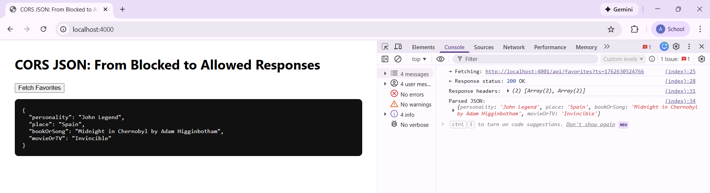
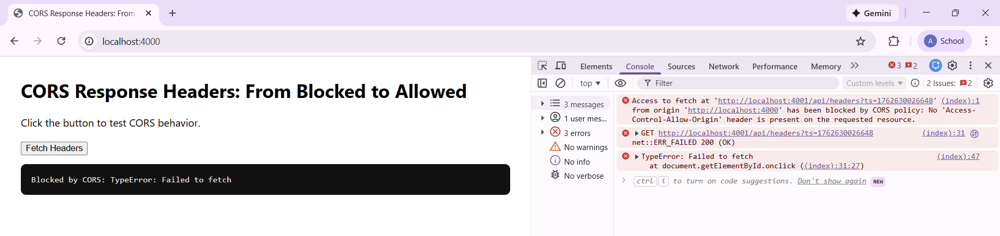
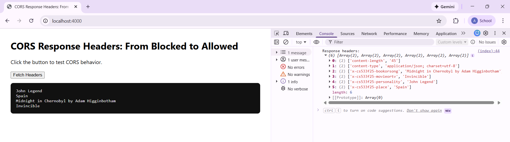
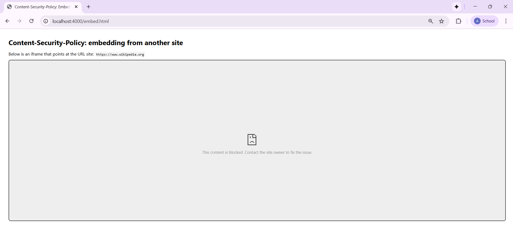
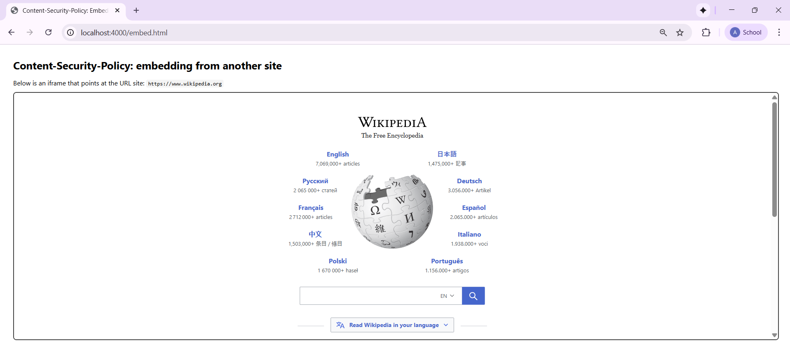

# Assignment 5 Submission

### Directories
All work for this assignment is organized under `assignments/Wright/5` and separated into these folders and files:
- **5.1** - Demonstrates how browsers block and allow cross-origin JSON requests depending on the server configuration.  
- **5.2** - Tests how browsers handle and expose custom HTTP response headers using CORS.  
- **5.3** - Shows how Content-Security-Policy (CSP) determines whether a remote site can be embedded within an iframe.  
- **README.md** - Contains descriptions, explanations, video links, and screenshots for each part of the assignment.  

---

### 5.1 - CORS JSON: From Blocked to Allowed Responses
This part of the assignment demonstrates how browsers enforce the Same-Origin Policy when trying to fetch JSON data from another origin.  
At first, the request is blocked because the server does not permit cross-origin access. After enabling the correct response headers, the JSON data is displayed successfully.

**Setup Explanation:**  
Both `serverA.js` (serving `index.html`) and `serverB.js` (returning JSON) run on **localhost:4000**. Although the code defines a secondary server to simulate a different origin, all demonstrations were done under the same port for simplicity and consistency with the screenshots.  

In PowerShell, I switched the CORS setting to demonstrate the blocked and allowed behavior:
```powershell
$env:ENABLE_CORS="false"; node serverB.js   # blocked
$env:ENABLE_CORS="true";  node serverB.js   # allowed
```
When `ENABLE_CORS` was set to `false`, the browser blocked the JSON request since the `Access-Control-Allow-Origin` header was missing. After restarting with `ENABLE_CORS=true`, the server added the proper header, allowing the page to fetch and display the data. This showed how changing the `ENABLE_CORS` setting affected whether the browser’s cross-origin requests were allowed or blocked.

- The first screenshot shows the **blocked request**, where the console indicates that the response has been stopped by the browser’s CORS policy.  
<br><br>

- The second screenshot shows the **allowed request**, where the data loads successfully once CORS is configured.  
<br><br>

---

### 5.2 - CORS Response Headers: From Blocked to Allowed
This section demonstrates how CORS affects the visibility of custom response headers.  
When headers are not explicitly exposed, the browser hides them to prevent data leaks. Once configured properly, the headers become visible, showing how CORS policies can safely expand browser access to trusted data.

**Setup Explanation:**  
The setup for 5.2 was the same as 5.1, with both the client and API hosted under localhost:4000. I changed `ENABLE_CORS` in PowerShell to show the blocked and allowed request:
```powershell
$env:ENABLE_CORS="false"; node serverB.js   # headers blocked
$env:ENABLE_CORS="true";  node serverB.js   # headers allowed
```
When CORS was disabled, the request succeeded but the custom headers were hidden. When enabled, the server included:
```
Access-Control-Allow-Origin: http://localhost:4000
Access-Control-Expose-Headers: X-CS533F25-Personality, X-CS533F25-Place, X-CS533F25-BookOrSong, X-CS533F25-MovieOrTv
```
This allowed the page to read and display the custom headers directly. Running both servers on the same port kept the setup simple and consistent with the results shown in the screenshots.

- The first screenshot shows the **blocked state**, where custom headers such as `X-CS533F25-Personality`, `X-CS533F25-Place`, `X-CS533F25-BookOrStrong`, and `X-CS533F25-MovieOrTv` are hidden.  
<br><br>

- The second screenshot shows the **allowed state**, where all exposed headers are now visible and readable by the browser. 
<br><br>

---

### 5.3 - Content-Security-Policy: Embedding from Another Site
This part shows how the CSP header determines whether a remote website can be displayed inside an iframe.  
When the policy restricts embedding, the page is blocked. Once the policy is updated to allow the external source, the iframe loads the page correctly.
This part shows how the CSP header determines whether a remote website can be displayed inside an iframe.  
When the policy restricts embedding, the page is blocked. Once the policy is updated to allow the external source, the iframe loads the page correctly.

**Setup Explanation:**  
For 5.3, I used a single Express server (`server.js`) on **localhost:4000**, serving as `embed.html`, which embeds `https://www.wikipedia.org` inside an iframe. The environment setting `ENABLE_EMBEDDING` was used to toggle the CSP behavior:
```powershell
$env:ENABLE_EMBEDDING="false"; node server.js   # blocked
$env:ENABLE_EMBEDDING="true";  node server.js   # allowed
```
When it was disabled, the header was set to `Content-Security-Policy: frame-src 'none';`, blocking all embedded content. So when it was enabled, it changed to `Content-Security-Policy: frame-src 'self' https://www.wikipedia.org;`, allowing the iframe to load normally.  

- The first screenshot shows the **blocked version**, where the CSP policy prevents the external site from loading in the frame.  
<br><br>

- The second screenshot shows the **allowed version**, where the Wikipedia page successfully loads inside the iframe once the CSP policy allows it.  
<br><br>

---

### Youtube Video Overview
* CORS: Blocking and reading responses from another origins (5.1): [https://youtu.be/TcWYnvGnTgw](https://youtu.be/TcWYnvGnTgw)
* CORS: Blocking and reading HTTP response headers from another origin (5.2): [https://youtu.be/kDiFyA0i5M4](https://youtu.be/kDiFyA0i5M4)
* Content-Security-Policy: embedding from another site (5.3): [https://youtu.be/JfHv_ZhxTpI](https://youtu.be/JfHv_ZhxTpI)
