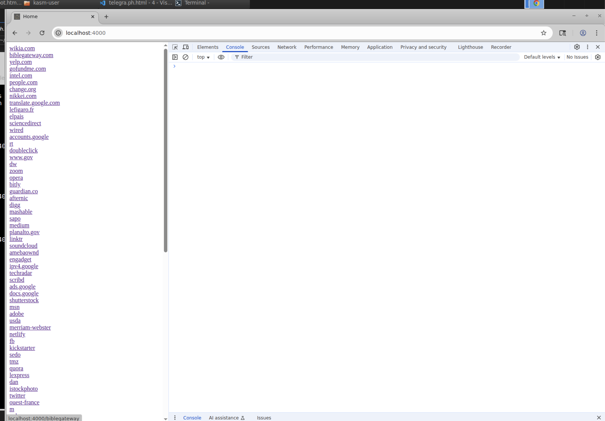
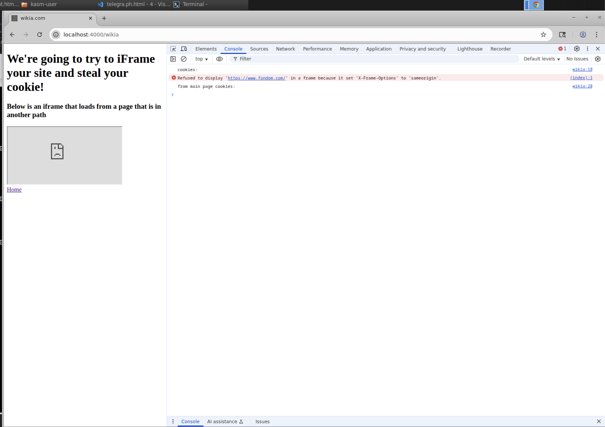

CS 533 Rodwin Spruel Assignment 4:
===================================

# Overview

### Framable Websites
For this assignment I created a python script that helped generate the html and js server files that
test if the 100 websites assigned to me are framable or not. They can be found in the following 
locations: 
[server.js](server.js)
[htmls_files](framable)
-----------------

### Frame Path Attack
For the frame path attack section, I followed the example in the course slide and set up a server 
that served regular pages and a separate attack server places a page from the regular server in an
iframe and captures the cookies from the page. The servers and codes can be found in the following folders:

[frame-path-attack/attack-server](frame-path-attack/attack-server)
[frame-path-attack/reg-server](frame-path-attack/reg-server)
-----------------

### Running Server
To run the servers, you just need to navigate to the folder where the server.js file is stored and run `npm start`

# Collection Tables

Below you will find a summary table that presents the summary stats from the 100 website and 
a details table that list is the site is framable or not, and if not the reason why.
-----------------

## Summary Table:

| Total URLs | # of Framable Sites | # of Non-Framable Sites |
|:----------:|:-------------------:|:-----------------------:|
| 100        |         25          |           75            |

## Details Table:

|URL|Framable|Reason Not Framable|
| :---: | :---: | :---: |
|wikia.com|N|in a frame because it set 'X-Frame-Options' to 'sameorigin'.Understand this error|
|biblegateway.com|Y|N/A|
|yelp.com|Y|N/A|
|gofundme.com|Y|N/A|
|intel.com|N|"because an ancestor violates the following Content Security Policy directive: ""frame-ancestors 'self' https://premiersupport.intel.com https://c0.avaamo.com *.intel.com""."|
|people.com|N|in a frame because it set 'X-Frame-Options' to 'sameorigin'.|
|change.org|N|"because an ancestor violates the following Content Security Policy directive: ""frame-ancestors 'self'""."|
|nikkei.com|N|"because an ancestor violates the following Content Security Policy directive: ""frame-ancestors 'self'""."|
|translate.google.com|N|403|
|lefigaro.fr|N|in a frame because it set 'X-Frame-Options' to 'sameorigin'|
|elpais.com|Y|N/A|
|sciencedirect.com|N|in a frame because it set 'X-Frame-Options' to 'sameorigin'. And 403|
|wired.com|Y|N/A|
|accounts.google.com|N|403|
|rt.com|Y|N/A|
|doubleclick.net|N|DNS error|
|www.gov.br|N|"because an ancestor violates the following Content Security Policy directive: ""frame-ancestors 'self'""."|
|dw.com|N|"because an ancestor violates the following Content Security Policy directive: ""frame-ancestors 'none'""."|
|zoom.us|Y|N/A|
|opera.com|N|"because an ancestor violates the following Content Security Policy directive: ""frame-ancestors 'self' https://*.opera.com""."|
|bitly.com|N|in a frame because it set 'X-Frame-Options' to 'deny'.|
|guardian.co.uk|N|in a frame because it set 'X-Frame-Options' to 'sameorigin'|
|afternic.com|N|DNS error|
|digg.com|Y|N/A|
|mashable.com|Y|N/A|
|sapo.pt|N|in a frame because it set 'X-Frame-Options' to 'sameorigin'.|
|medium.com|N|" because an ancestor violates the following Content Security Policy directive: ""frame-ancestors 'self' https://medium.com""."|
|planalto.gov.br|N|" because an ancestor violates the following Content Security Policy directive: ""frame-ancestors 'self'""."|
|linktr.ee|N|"because an ancestor violates the following Content Security Policy directive: ""frame-ancestors 'self'""."|
|soundcloud.com|N| in a frame because it set 'X-Frame-Options' to 'sameorigin'.|
|amebaownd.com|N| in a frame because it set 'X-Frame-Options' to 'sameorigin'.|
|engadget.com|N|"because an ancestor violates the following Content Security Policy directive: ""frame-ancestors 'self' https://*.engadget.com https://*.oath.com https://*.yahoo.com""."|
|ipv4.google.com|N|Connection error|
|techradar.com|N|"because an ancestor violates the following Content Security Policy directive: ""frame-ancestors self""."|
|scribd.com|N|"because an ancestor violates the following Content Security Policy directive: ""frame-ancestors 'self'""."|
|ads.google.com|N|403|
|docs.google.com|N|403|
|shutterstock.com|Y|N/A|
|msn.com|N|"because an ancestor violates the following Content Security Policy directive: ""frame-ancestors 'self' int1.msn.com ntp.msn.cn ntp.msn.com windows-int1.msn.com windows.msn.cn windows.msn.com www.bing.com www.msn.com mathsolver.microsoft.com mathsolver-dev.microsoft.com chrome-extension://lklfbkdigihjaaeamncibechhgalldgl"""|
|adobe.com|Y|N/A|
|usda.gov|N|in a frame because it set 'X-Frame-Options' to 'sameorigin'.|
|merriam-webster.com|Y|N/A|
|netlify.app|Y|N/A|
|fb.me|N|in a frame because it set 'X-Frame-Options' to 'deny'.|
|kickstarter.com|N|in a frame because it set 'X-Frame-Options' to 'sameorigin'.Understand this error|
|sedo.com|N|in a frame because it set 'X-Frame-Options' to 'sameorigin'.|
|tmz.com|N|in a frame because it set 'X-Frame-Options' to 'sameorigin'.Understand this error|
|quora.com|N|in a frame because it set 'X-Frame-Options' to 'sameorigin'.Understand this error|
|lexpress.fr|Y|N/A|
|dan.com|N|DNS error|
|istockphoto.com|N|in a frame because it set 'X-Frame-Options' to 'sameorigin'.|
|twitter.com|N|in a frame because it set 'X-Frame-Options' to 'deny'.|
|ouest-france.fr|N|"because an ancestor violates the following Content Security Policy directive: ""frame-ancestors *.ouest-france.fr www.google.com https://amp-ouest--france-fr.cdn.ampproject.org http://www.ultimedia.com https://fr.ouestfrance.ouestfrance *.presseocean.fr *.courrierdelouest.fr *.lemainelibre.fr *.maville.com *.francelive.fr *.sipaof.fr ouest-france.geovoile.com""."|
|m.me|N|in a frame because it set 'X-Frame-Options' to 'deny'.|
|ovh.com|Y|N/A|
|sendspace.com|N| in a frame because it set 'X-Frame-Options' to 'sameorigin'.|
|indiegogo.com|N| in a frame because it set 'X-Frame-Options' to 'sameorigin'.|
|nginx.com|N|"because an ancestor violates the following Content Security Policy directive: ""frame-ancestors 'self' *.cybersource.com *.salesforce.com *.force.com *.salesforce-sites.com""."|
|youtu.be|N|in a frame because it set 'X-Frame-Options' to 'sameorigin'.|
|forbes.com|N|in a frame because it set 'X-Frame-Options' to 'sameorigin'.Understand this error|
|ea.com|N|"because an ancestor violates the following Content Security Policy directive: ""frame-ancestors 'self'""."|
|justice.gov| N| in a frame because it set 'X-Frame-Options' to 'sameorigin'.|
|mozilla.org|N|"because an ancestor violates the following Content Security Policy directive: ""frame-ancestors 'none'""."|
|theatlantic.com|Y|N/A|
|amzn.to|N| in a frame because it set 'X-Frame-Options' to 'sameorigin'.|
|sedoparking.com|N|DNS error|
|linkedin.com|N|" because an ancestor violates the following Content Security Policy directive: ""frame-ancestors 'self' *.www.linkedin.com:*""."|
|canada.ca|N|in a frame because it set 'X-Frame-Options' to 'deny'.|
|telegra.ph|N|DNS error|
|reuters.com|N|"because an ancestor violates the following Content Security Policy directive: ""frame-ancestors 'self'""."|
|tinyurl.com|N|in a frame because it set 'X-Frame-Options' to 'sameorigin'.|
|taringa.net|Y|N/A|
|nginx.org|N|"because an ancestor violates the following Content Security Policy directive: ""frame-ancestors 'self' *.cybersource.com *.salesforce.com *.force.com *.salesforce-sites.com""."|
|buydomains.com|Y|N/A|
|hp.com|N|in a frame because it set 'X-Frame-Options' to 'sameorigin'.Understand this error|
|google.it|N|in a frame because it set 'X-Frame-Options' to 'sameorigin'.|
|it.wikipedia.org|Y|N/A|
|mit.edu|N|"because an ancestor violates the following Content Security Policy directive: ""frame-ancestors 'self' https://web.mit.edu https://www.mit.edu http://web.mit.edu http://www.mit.edu""."|
|files.wordpress.com|N|in a frame because it set 'X-Frame-Options' to 'sameorigin'.|
|standard.co.uk|N|"because an ancestor violates the following Content Security Policy directive: ""frame-ancestors 'self' https://*.brightsites.co.uk""."|
|last.fm|N|in a frame because it set 'X-Frame-Options' to 'deny'.Understand this error|
|twimg.com|N|DNS error|
|bp.blogspot.com|N|DNS error|
|telegram.me|N| in a frame because it set 'X-Frame-Options' to 'sameorigin'.|
|foursquare.com|N|in a frame because it set 'X-Frame-Options' to 'sameorigin'.|
|outlook.com|N|"because an ancestor violates the following Content Security Policy directive: ""frame-ancestors 'self' teams.microsoft.com""."|
|samsung.com|N|in a frame because it set 'X-Frame-Options' to 'sameorigin'.Understand this error|
|bbc.co.uk|N|"because an ancestor violates the following Content Security Policy directive: ""frame-ancestors 'none'""."|
|ssl-images-amazon.com|N|DNS error|
|stackoverflow.com|N|"because an ancestor violates the following Content Security Policy directive: ""frame-ancestors 'self' https://stackexchange.com""."|
|interia.pl|Y|N/A|
|google.com.tw|N|in a frame because it set 'X-Frame-Options' to 'sameorigin'.|
|usatoday.com|N|"because an ancestor violates the following Content Security Policy directive: ""frame-ancestors 'none'""."|
|disqus.com|Y|N/A|
|picasaweb.google.com|N|404 ERROR|
|doi.org|Y|N/A|
|fr.wikipedia.org|Y|N/A|
|springer.com|Y|N/A|
|liveinternet.ru|N|DNS error|
|ap.org|Y|N/A|

-----------------

## Example Images
Here's an example of the framable and non-framable server homepage:

Here's an example of a site that is framable:

And here's an example of a site that is not framable:

Finally here's an example of cookies getting captures from a iframed page:

## Youtube Video

To view the script running you can check out the following video on YouTube: https://youtu.be/g6Cv5a8Dm9c

## Parsers Parsers Everywhere!

This seems to be a loose reference to a part of the 
"water, water, everywhere" from Samuel Coleridge's poem The Rime of the Ancient Mariner: Water, water everywhere.
My guess is that there is an attempt to draw a comparison between the overwhelming feeling of being
suronuded by so much water at sea but not having any to drink and the number of parsers and steps
involved in processing and rendering a web page. 
-----------------
