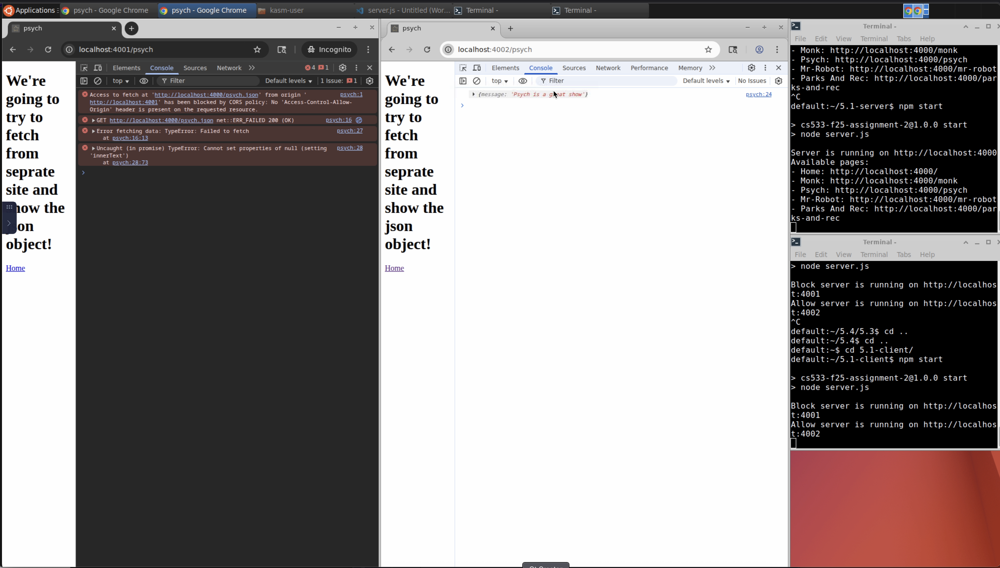
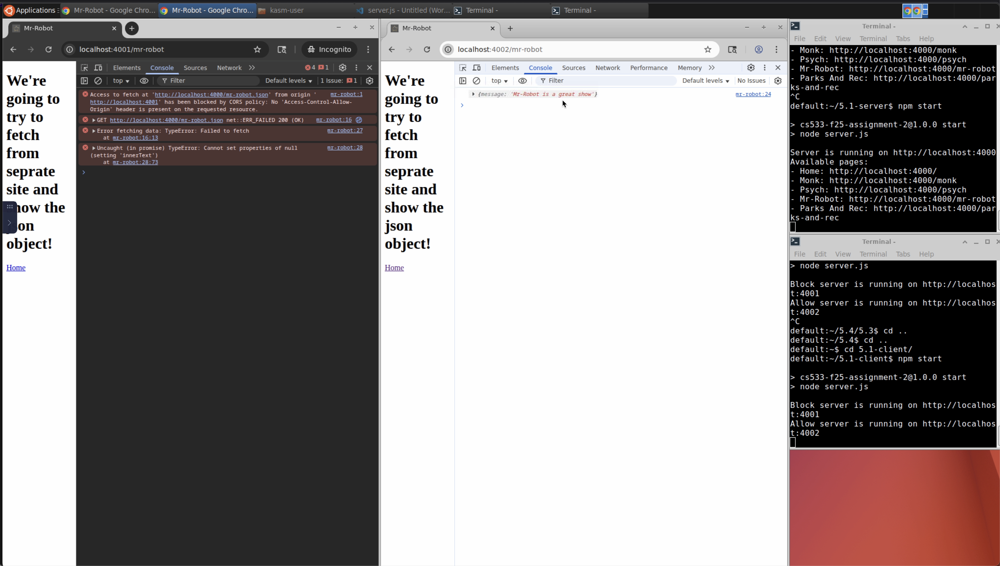
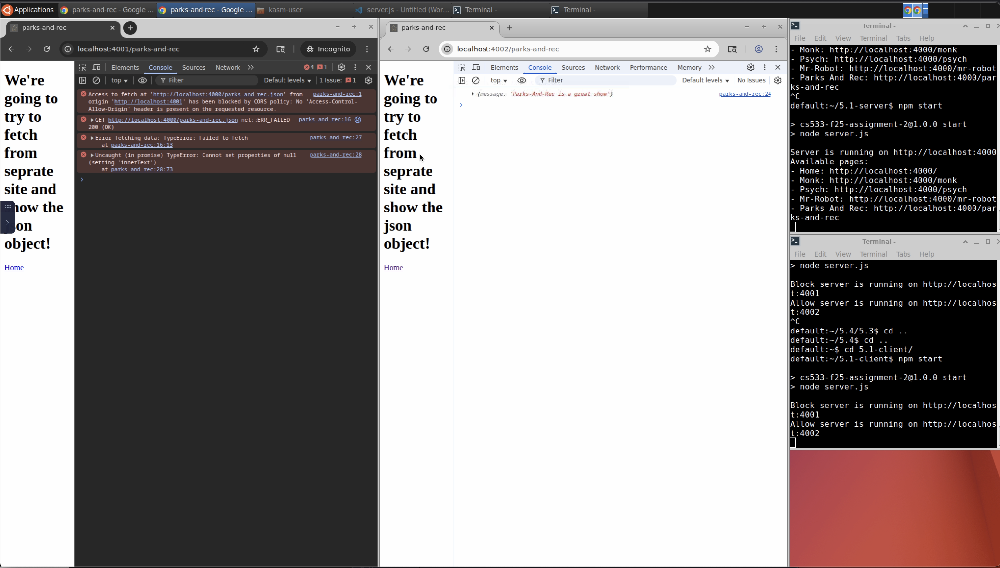
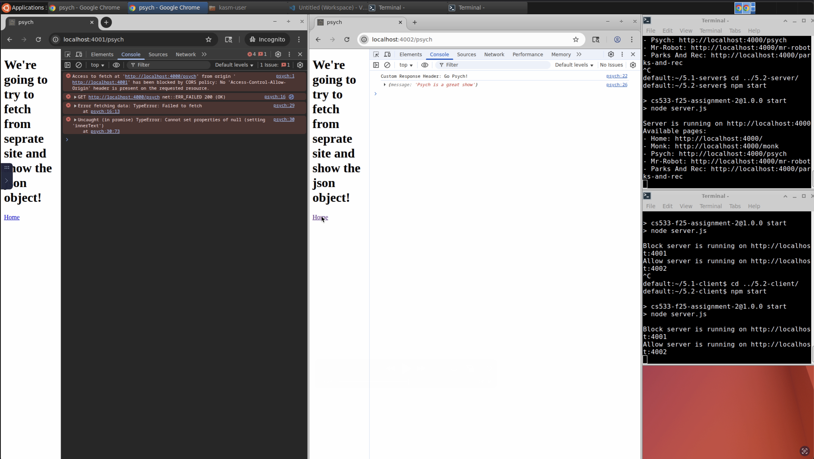
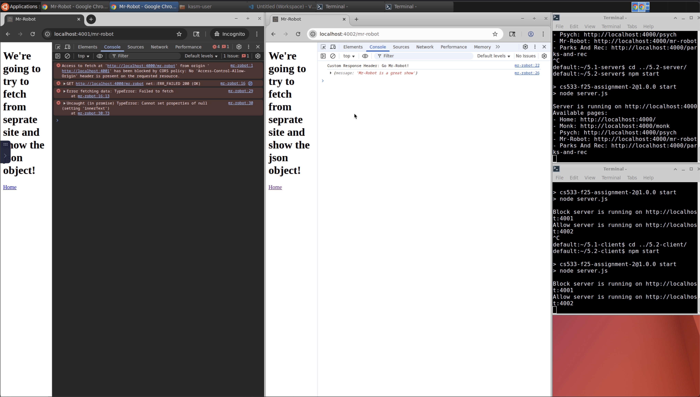
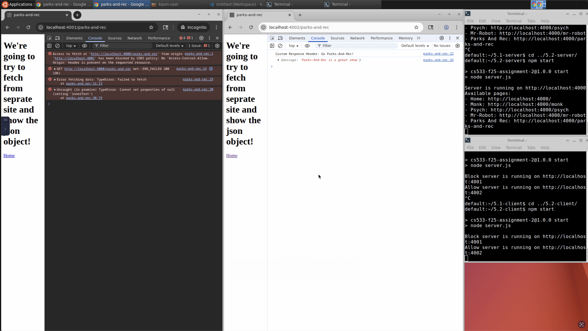
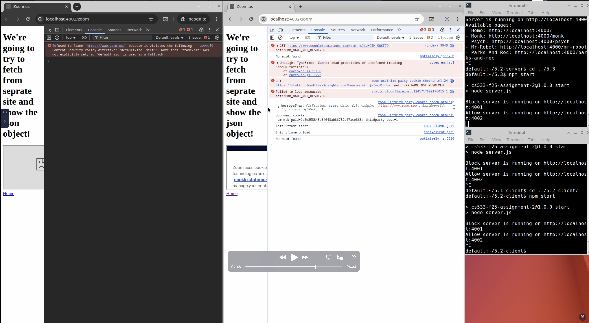

CS 533 Rodwin Spruel Assignment 5:
===================================

# Overview
#### To run the servers, you just need to navigate to the folder where the server.js file is stored and run `npm start`

### This assigment focuses on the following topics:

### CORS: Blocking and reading responses from another origin
Default policies in most browsers and express.js server is to block cross-origin requests (CORS). Updating the CORS policy 
on the express server to allow request from certain origins fixes the issue. In this project the 5.1-server folder contains 
the express server that is issuing/serving the json data. This is where the allowed origins are specified using the CORS
package and setting adding desired origins to the origins list(see line [16](5.1/5.1-server/server.js)). The 5.1-client folder contains the express server that is 
requesting the json data and serving the html files that the displayed in the demos. 

[server files](5.1/5.1-server)
[cleint files](5.1/5.1-client)
-----------------

## Example Images
Here's an example for the Monk entry:

Here's an example for the Psych entry:

Here's an example for the Mr.Robot entry:

Here's an example for the Parks and Rec entry:

-----------------

### CORS: Blocking and reading HTTP response headers from another origin
Default policies in most browsers and express.js server is to block cross-origin custom headers (CORS). Updating the CORS policy
on the express server to allow custom headers from certain origins fixes the issue. In this project the 5.2-server folder contains
the express server that is issuing/serving the json data. This is where the allowed origins are specified using the CORS
package and setting adding desired origins to the origins list(see line [10](5.2/5.2-server/server.js)). The 5.2-client folder contains the express server that is
requesting the json data and serving the html files that the displayed in the demos.

[server files](5.2/5.2-server)
[cleint files](5.2/5.2-client)

-----------------

## Example Images
Here's an example for the Monk entry:

Here's an example for the Psych entry:

Here's an example for the Mr.Robot entry:

Here's an example for the Parks and Rec entry:

-----------------

### Content-Security-Policy: embedding from another site
Default policies zoom.us allowed the site to be embedded into other sites, and the express server will allow loading of the
embedded content. We can update the content security policy on the express server to allow or deny the embedding of other 
sites (see line [16](5.3/5.3/server.js)). 

[server files](5.3/5.3)

-----------------

## Example Images
Here's an example for the Zoom.us entry:

h="700">

-----------------

### GitHub Pages: embedding from another site
The process from 5.1 - 5.3 is repeated for having content loaded from github pages.
GitHub pages does not allow setting custom headers and other CORS policy, so a service like cloudflare is needed to set this.

[5.1 server files](5.4/5.1)
[5.2 server files](5.4/5.2)
[5.3 server files](5.4/5.3)

-----------------

## Youtube Video

To view the script running you can check out the following video on YouTube: https://youtu.be/x-x1etwbdSc
