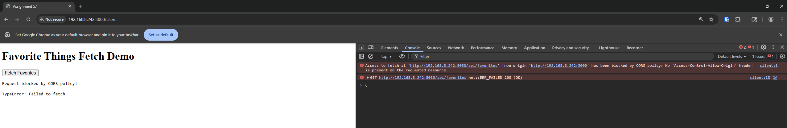
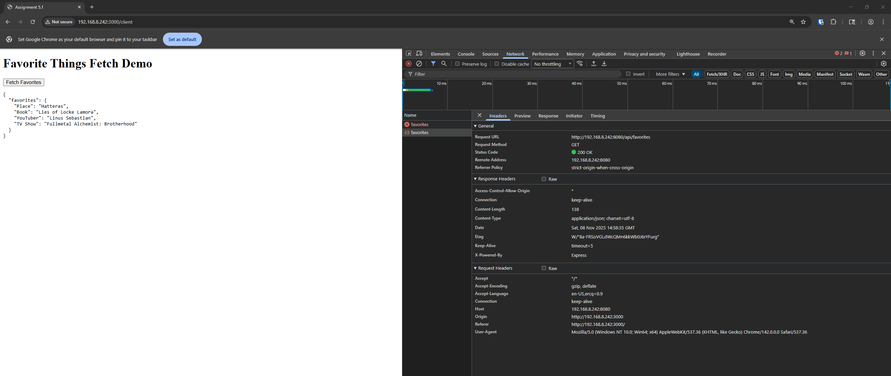
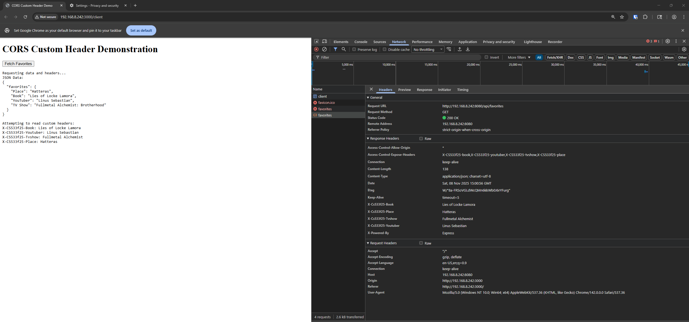
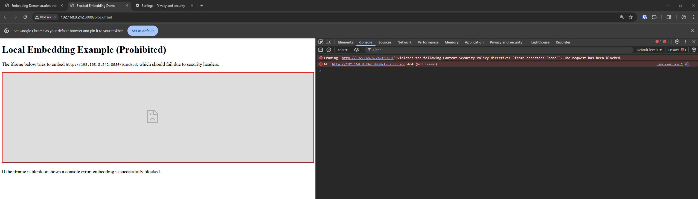
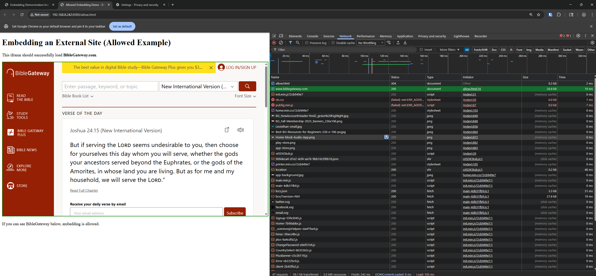

# Assignment 5

## 5.1 

### File Structure
```
|--5
    |--5.1
        |--node_modules           #Contains Node modules for Node Express and CORS
        |--client.html            #Client Webpage for testing CORS
        |--favorites.json         #JSON Document containing My favrote things from Assigment 2
        |---package-lock.json     #NPM Lock File
        |--package.json           #NPM Package Manifest
        |--server.js              #Javascript for hosting the server backend
```

### How to Run
1. Modify line 18 to the ip address of your hosting server or localhost in your client.html file.
2. Open two terminal windows
3. In one Terminal run npx serve
4. Another one terminal node server.js
5. Navigate to your http://IP:8080/client.html
6. Press the Button to see your request blocked by CORS
7. Stop the node server.js application
8. Start again with the "--allow-wildcard-cors" flag to enable an insecure CORS configuration.
9. Press the button again and see the request come through.

#### Note
Using Wildcards CORS is a really bad practice, you should explictedly define each allowed domain. Most common practice is just use on of the many reverse proxies avaiable on the internet, many of them such as nginx are free to use.

[Video Demo](https://youtu.be/CSIvSDMwfo0)

### Screenshots
#### Blocked By CORS

#### Allowed By CORS


## 5.2

### File Structure
```
|--5
    |--5.2
        |--node_modules           #Contains Node modules for Node Express and CORS
        |--client.html            #Client Webpage for testing CORS Response Headers
        |--favorites.json         #JSON Document containing My favrote things from Assigment 2
        |---package-lock.json     #NPM Lock File
        |--package.json           #NPM Package Manifest
        |--server.js              #Javascript for hosting the server backend
```

### How to Run
1. Clear your Cache, and refresh the window if you just ran 5.1
2. Modify line 18 to the ip address of your hosting server or localhost in your client.html file.
3. Open two terminal windows
4. In one Terminal run npx serve
5. Another one terminal node server.js
6. Navigate to your http://IP:8080/client.html
7. Press the Button to see your request blocked by CORS
8. Stop the node server.js application
9. Start again with the "--allow-wildcard-cors" flag to enable an insecure CORS configuration.
10. Press the button again and see the request come through.

[Video Demo](https://youtu.be/7s4nS8mLD84)

### Screenshots
#### Blocked By CORS

#### Allowed By CORS


## 5.3

### File Structure
```
|--5
    |--5.3
        |--node_modules           #Contains Node modules for Node Express and CORS
        |--allow.html             #Client Webpage for testing CORS via the use of Iframes
        |--block.html             #Client Webpage for testing CORS blocking external access
        |--index.html             #Client Webpage easily navigating between the two pages
        |---package-lock.json     #NPM Lock File
        |--package.json           #NPM Package Manifest
        |--server.js              #Javascript for hosting the server backend
```

### How to Run
1. Modify line 13 to the ip address of your hosting server or localhost in your block.html file.
2. in a terminal run node server.js
3. Navigate to your http://IP:8080/
4. Navigate to the Allow Page
5. Go back to the index and Navigate to the blocked page.

[Video Demo](https://youtu.be/s7Y8PEVDbGw)


### Screenshots
#### Blocked By CORS

#### Allowed By CORS
